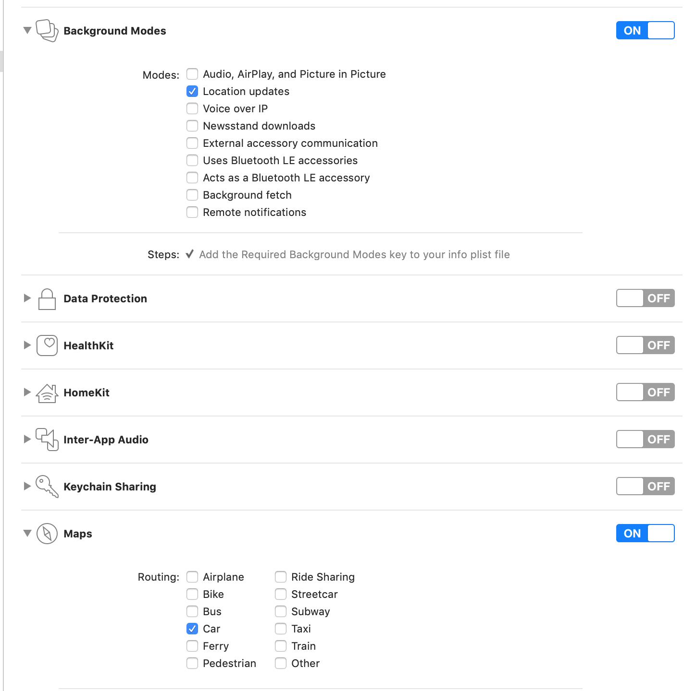
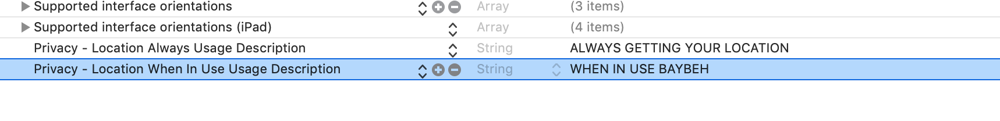
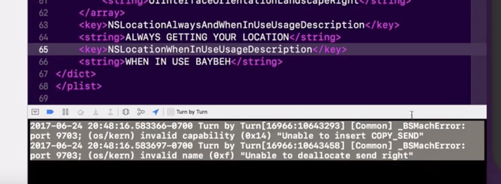

# MapKit: Turn-By-Turn Navigation

## Tools

- Xcode 9 beta 2
- Swift 4
- MapKit
- Core Location
- AVFoundation

## Initial settings

For some reason, if we allow all `Privacy - Location` properties, then it doesn't work. So we need to put only those property in info.plist

then, you'll encouter this error

Don't get panic, just replace it with the previous one.

## TODO
- `didEnterRegion` event doesn't get fired.
  - tried
    - https://stackoverflow.com/a/21821959/5260068
    - https://stackoverflow.com/a/44829449/5260068
  - not yet
    - https://stackoverflow.com/a/28093371/5260068